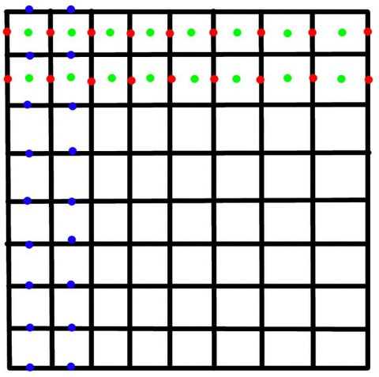
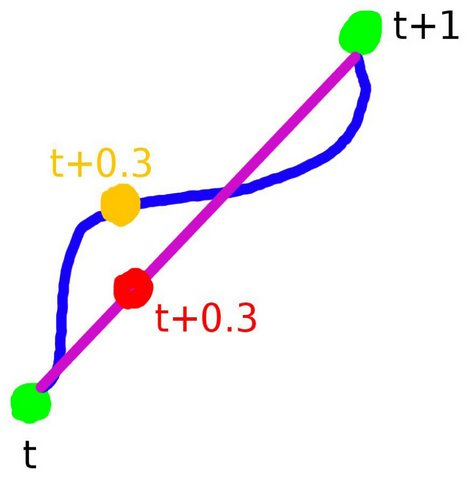
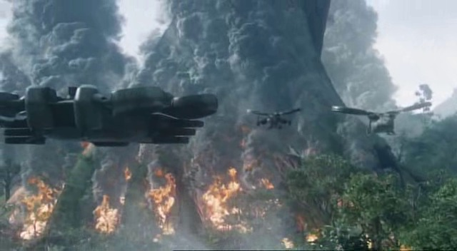
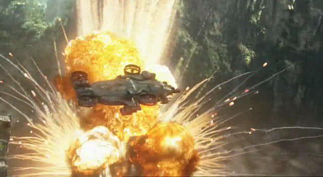
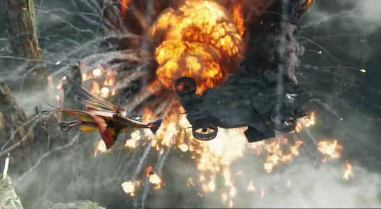
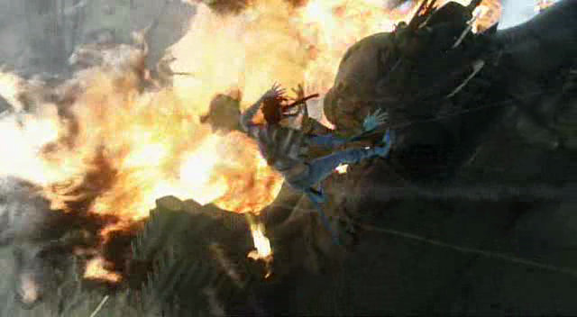
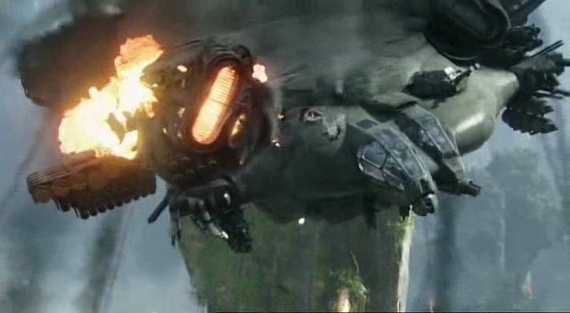

This technical paper was written in 2009 to document the fluid retimer / readvection algorithm that I developed for the movie [Avatar](https://www.avatar.com/movies/avatar).

This technique only covers grid / voxel-based fluids, not particule / SPH-based fluids.

# Voxel grid structure

The first step of a retimer is to have a very good (i.e. very fast) voxel grid structure. Millions of reads/computations will be done so we'll try to get something fast and optimized.

The voxel grid structure can be templated with its dimension `MyVoxGrid<D>` to use it in 2d (`MyVoxGrid<2>`), 3d (`MyVoxGrid<3>`) or whatever other dimension. It needs to be able to store a list of attributes, each attribute being either a `float`, `float2`, `float3`, `float4`, `int`, `byte`, etc. (`float` and `float3` being the most useful). For memory and speed issues we are using single float precision (i.e. 32 bits) scalar type. If double precision is needed, it can be templated.

Each attribute has a spacing: either center, corner or face (with a direction: X, Y or Z) spacing. In [Autodesk Maya](https://www.autodesk.com/products/maya), the density and temperature attributes are `float` with a center spacing. The velocity attribute is `float3` with a face spacing (`faceX` spacing for `velocityX`, `faceY` spacing for `velocityY` and `faceZ` spacing for `velocityZ`).

Let's illustrate this in 2d. In the image below, in green you have the density (center spacing), in red the velocity along X axis (`faceX` spacing) and in blue the velocity along Y axis (`faceY` spacing).

The most important feature in this voxel grid structure is to be able, for any point, to get the interpolated value accordingly to the spacing.

The voxel is saved in memory as a flat, 1d array, with a contiguous memory layout. Each voxel has a 1d index corresponding to the position of the voxel in the array. A matrix of dimension `(D+1 x D+1)` will be associated to the grid to place it in space. For axis-aligned grids, you can replace the `(D+1 x D+1)` matrix with `D` floats, each float being the size of each dimensions of the grid. You can also have `D + D` floats where the first `D` floats are the size the each dimensions of the grid and the `D` last floats are the center point of the grid.

In 2d, we will have `2 + 2` floats = `4` floats. For example `[4, 4, 2, 2]` means that the size along X and Y of the grid is `4` and that the center of the grid is the point `[2, 2]`:

* The bottom left point will be `[0, 0]`
* The bottom right point will be `[4, 0]`
* The top left point will be `[0, 4]`
* The top right point will be `[4, 4]`

The grid will have 2 index-based positions:

* The `1d` index-position
* The `Dd` index-position

If we take a 2d grid of size `3 x 3` (9 voxels). Let's take the voxel with the `1d` position `[5]`. Its `Dd` index-position (2d index-position in this case) will be `[2, 1]` (because `5 = 1 * 3 + 2`).

For a spacial `Dd` position, you should be able with the `(D+1 x D+1)` matrix to find the `Dd` and `1d` indices.

In 3d, for any 3d point inside the grid, we can find in which voxel the point is (i.e. we find first its 3d index-position) and then convert it to a 1d index-position.

Once you have everything needed, a special class for 3d grids can be created as ours fluids are defined as 3d grids most of the time: you can write a class deriving from `MyVoxGrid<3>` (3d grid) where extra utility functions will be added, related for example to loading/saving fluids from/to gto/pdc cache (or any other file format) as well as the retimer / readvection function that we'll now describe.

# Retiming / readvection

Now comes the retiming issue: you have a voxel grid cache at frame `t` and one at frame `(t+1)`. You want to know what its state is at frame `t+n` (`0.0 < n < 1.0`). The result needs to be as close to what you would get is you were simulating it. If you retime with a time scale factor of 0.1 (10x slower), you will need to retime 9 extra caches per frame at `t+0.1`, `t+0.2`, ..., `t+0.9`.

You can visualize this algorithm with a river. You have 2 points in space `P0` and `P1` which are the 2 values of an attribute you want to retime (for example the density) at `t` and `t+1`. Between those 2 values are the values this attribute will have between `t` and `t+1`: if you draw all the values of this attribute between `t` and `t+1` you will end up with a curve which is our river.

Retiming the voxel grid is to find values which are as close as possible from the river.

The 2 green dots are the 2 points `P0` and `P1`. The blue curve is our river. In purple line is the shape of the river if we do a linear interpolation between `t` and `t+1`. The red dot is the value of the attribute at `t+0.3` with a linearly interpolated point (`P2`). The orange value is the real value of this attribute at the same time if it was simulated (`P3`). `||P2 - P3||` is our retiming residual (error).

If you throw a piece of paper in the river at time `t` at position `P0`, it will be at position `P1` at `t+1` and at position `P3` at `t+0.3`.

These positions are definining the river shape. The velocity attribute can be visualized as the tangent to the curve representing the river as the first derivative of these positions, defined for any position P (as the function is continuous).

The first step is to retime these velocities. Here's the problem: you don't know the value of the velocities at `t+n` and you don't know how the velocity will change for a specific local area of the grid: maybe it will accelerate between `t` and `t+0.2`, slow down between `t+0.2` and `t+0.7` and accelerate again between `t+0.7` and `t+1`.

In practice, it's fine to assume that velocities should not change much between `t` and `t+1` (i.e. its local derivative is zero for a small time step). That's why you can simply do a linear interpolation between `t` and `t+1` from the 2 voxel grids you have at `t` and `t+1`.

You can also read caches at `t-1` and `t+2` and do a cubic interpolation but it will cost you more, mostly in term of memory. Generally retimed velocities are not needed, unless you use them in a shader or do some extra post-­process - or if you want to retime the retimed cache later.

The retiming process will be a re­advection of the fluid. You will have 2 advections: one forward advection from `t` to `t+n` (from `P0` to `P3`) and one backward advection from `t+1` to `t+n` (from `P1` to `P3`).

The final value will be a weighted sum of these 2 forward and backward advections: `val = (1 - n) * val_forward + n * val_backward`.

Each advection will be processed in multiple steps. Let's see first how the algorithm works with only one step. For example you want to retime the fluid density attribute. This attribute has a center spacing: you will have `(X­1) * (Y­1) * (Z­1)` values to retime. The position of each value is at the center of each voxel. Let's retime for a specific position `P`.

During the forward advection, you will take the voxel grid at frame `t` and read the velocity `V0(P)` at position `P`. You will then find a new position `P0` which is `P0 = P – n * V0(P)` (i.e. what will be at `P` in `n` second). You will read the density `d0` from this voxel grid at position `P0`.

In a similar way, the backward advection will take the voxel grid at frame `t+1` and read the velocity `V1(P)` at position `P`. You will then find a new position `P1` which is `P1 = P + (1 - n) * V1(P)` (i.e. what was the density at `P` `1-­n` second ago). You will read the density `d1` from this voxel grid at position `P1`.

The new retimed density `d` at position `P` will be a mix between the density computed during the forward advection and the one computed during the backward advection: `d = (1 - n) * d0 + n * d1`.

In practice, doing only 1 step advection is in most cases not good enough. Starting from `P` and going directly to `P0` or `P1` in a straight line means that you are losing quite a lot of information.

What you want to do is to go from `P` to `P0` and `P1` in multiple steps. Let's take the forward advection. Let's say that you want a step size of 0.1 (i.e. 10 steps) and n is 0.3.

You will then have 3 steps of size 0.1:

* Step1: `P00 = P - (n/3) * V0(P)`
* Step2: `P01 = P00 - (n/3) * V0(P00)`
* Step3: `P02 = P01 - (n/3) * V0(P01)`

Your new, more acurate `P0` will be `P02` (last step). You will have a similar result for the backward advection with 7 steps of size 0.1. For each step you will have to sample the velocity at the new step­position which will be used for the next step. You have to find a good value for the number of steps you want, not too small to give you enough details and not too high to be fast enough.

The next idea is to try to reduce the noise you will get from the retiming process. For this we will simulate motion blur (centered). We will specify a shutter speed (`SS`, for example 0.25) and a number of time steps (`nts`, generally 3). Without motion blur, you advect each point at time `n` (forward) and `1 - n` (backward). Instead of doing 2 advections per point, you will do `nts * 2` advections (i.e. 6 if `nts` is 3).

* Time step 1: Forward advection at `nn = n - 0.5 * SS` and backward advection at `1 - nn`
* Time step 2: Forward advection at `nn = n` and backward advection at `1 - nn`
* Time step 3: Forward advection at `nn = n + 0.5 * SS` and backward advection at `1 - nn`

Each time step will give you a value. The final value will simply be the sum of each time step value divided by the number of time steps. You can have a more advanced weighting function.

`nts` has a big impact on performance so you generally not want to use a value greater than 3. You will also have to choose the shutter speed wisely, depending on the nature of your fluid to avoid too much noise (value too low) or too much blur (value too high).

Please note that this retiming algorithm can be multi­threaded as we'll see next.

# Multi-threading

This technique can be easily multithreaded since each voxel of the fluid is independent from its neighbors. You can randomly create blocks of voxels and each thread will compute each pool of voxels. In practice, each pool of voxels will be neighbors (in the chosen memory layout) to reduce cache misses and memory lookups.

# Testing

To test the quality of the algorithm, you can compute a slow fluid simulation with 101 frames (0 to 100) and only keep every 1/10 cache files: `cache0`, `cache10`, `cache20` ... `cache100`. Then simply retime this cache sequence with a time scale factor of 0.1.

If your algorithm is perfect, you should retrieve your original simulation. In practice, it should be different but close enough. Just take a frame (`cache53` for example) and compare it with the original simulated one and calculate some metric (deviation). Play with various settings and keep the one which make the deviation as small as possible.

Do the same test with various simulations (some slower, some faster, some with a lot of turbulences, etc.) and compare a retimed cache with the simulated one to make sure your readvection behave correctly with various edge cases.

# Results

Many of the Avatar explosions and fires simulations have been retimed through this algorithm. A library with key original simulations was created and many retimed versions were processed for each shots of the movie to add diversity and avoid the cost of computing per shot simulations as the cost of retiming an existing simulation is a tiny fraction of the cost of simulation it.

All images below are (c)2009 James Cameron & Twentieth Century Fox

The hometree fire below has been retimed at 60% of its original speed.

The Valkyrie Shuttle explosion below has been retimed at 75% of its original speed.

The Dragon explosion below is also using various retimed fluids between 60% and 80% of their original speeds.

